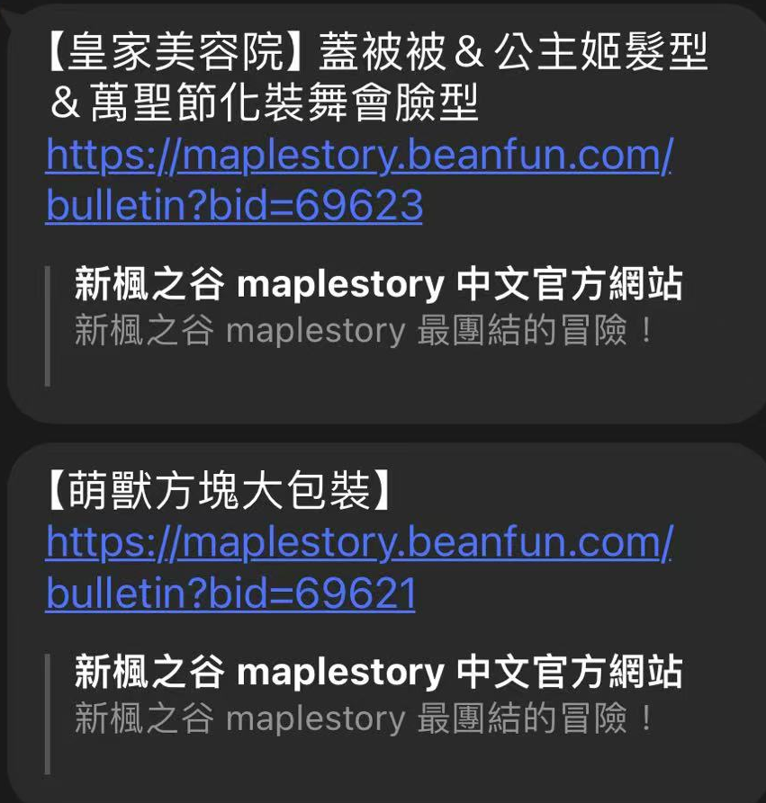

# LINE 楓之谷活動通知機器人
### 這是一個楓之谷機器人，架設自己的 Lline 機器人，拉進群組後每當楓之谷活動公告時就會在群組發出通知。
## 要求
要運行機器人需要安裝 node.js
## 安裝
1. 克隆存儲庫: `git clone git@github.com:s26016041/line-maplestory-activity-notification.git`
2. 安裝套件: `npm install`
3. 將 `.env` 替換成你的 Line 機器人 token
4. 可以用 localtunnel 在本地電腦架設服務器獲取URL 並填入 Line 的 Webhook網址: `npx localtunnel --port 8080`
5. 啟動機器人 `node main.js`
## 注意事項
1. 預設運行在端口 `8080` 需要修改可以修改 `app.listen(8080)` 中的數字
## 截圖

## 免責聲明
該機器人僅用於教育目的。